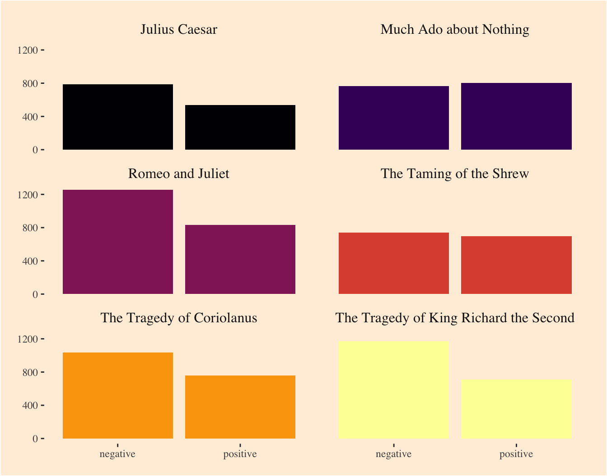
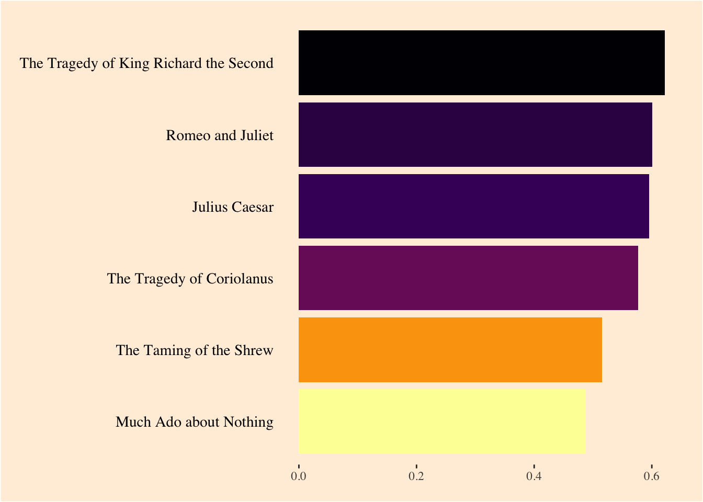
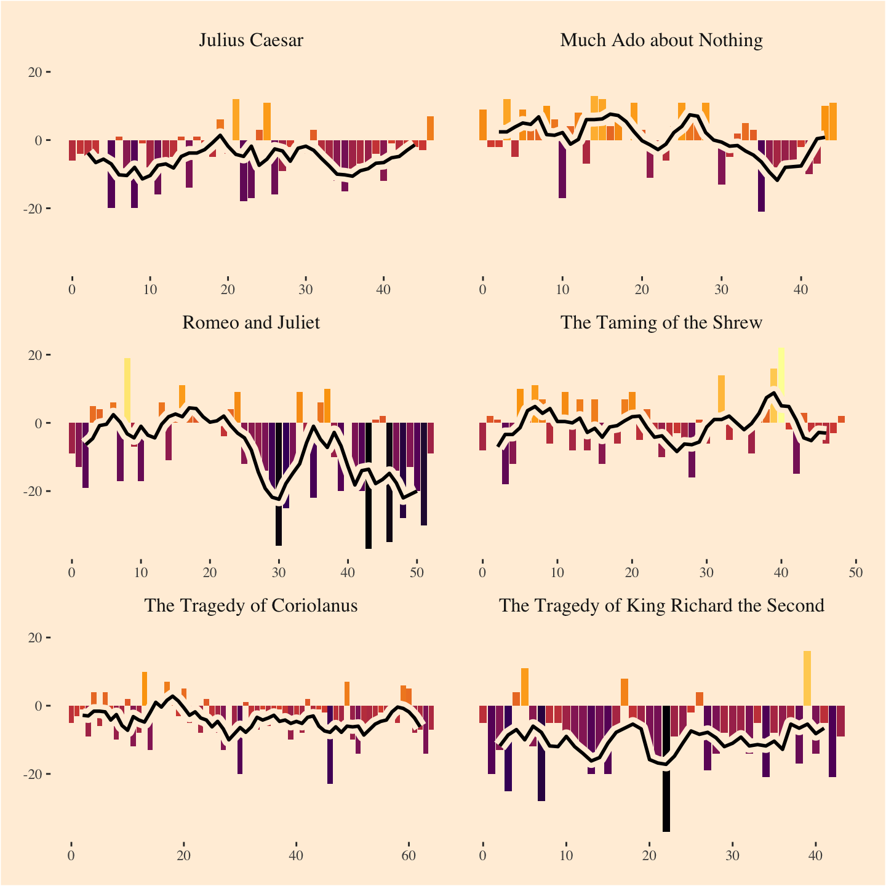
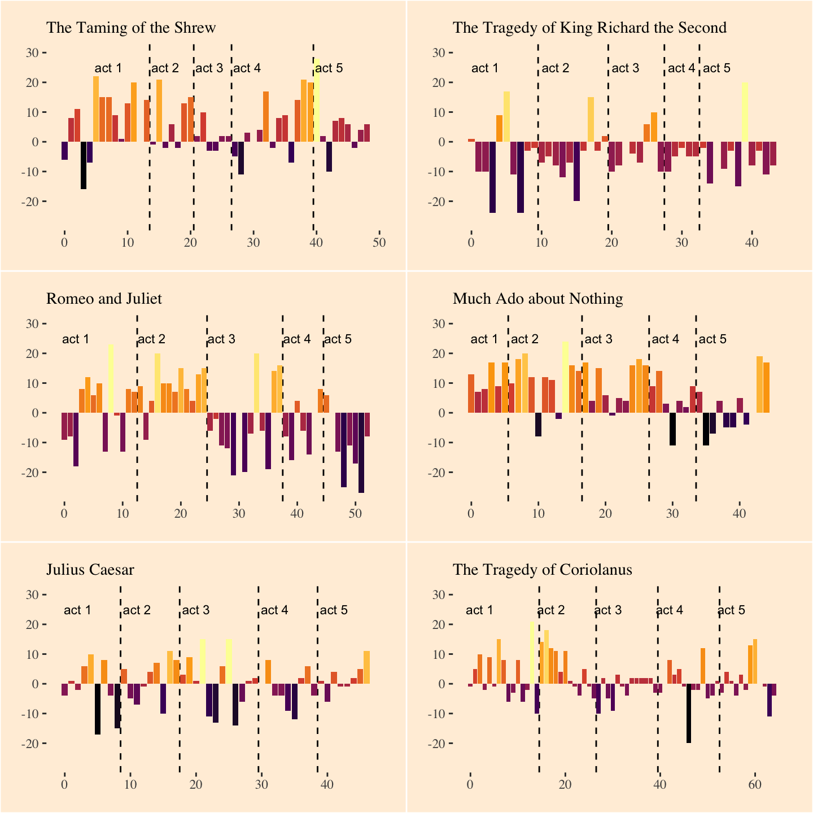
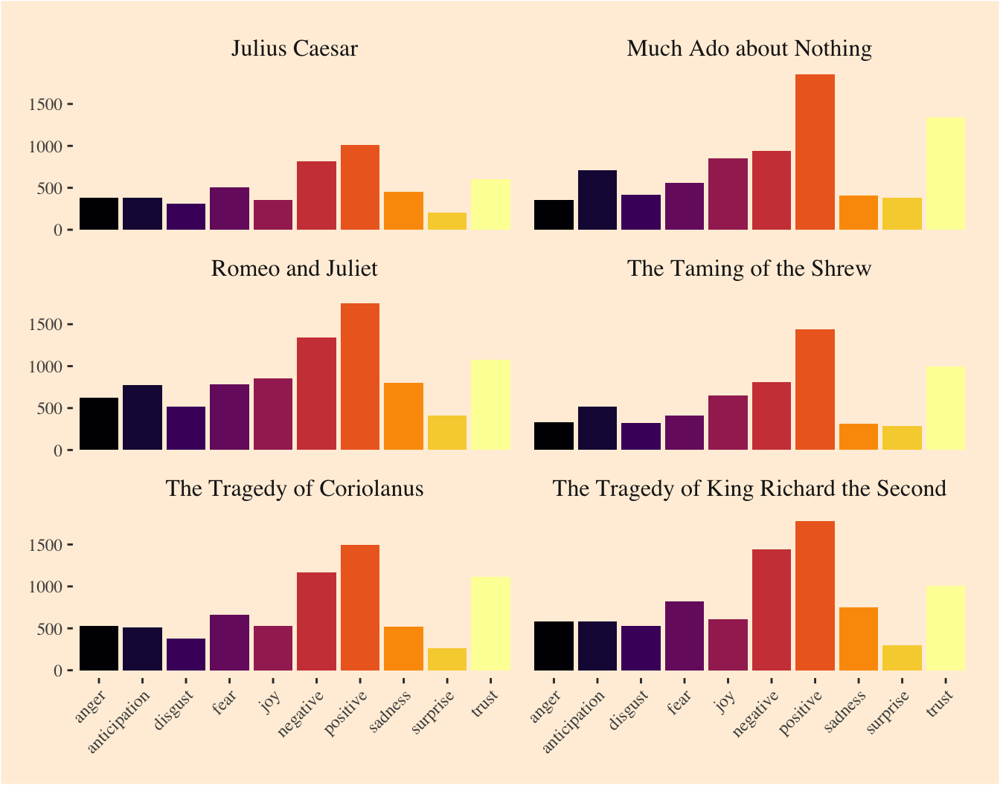
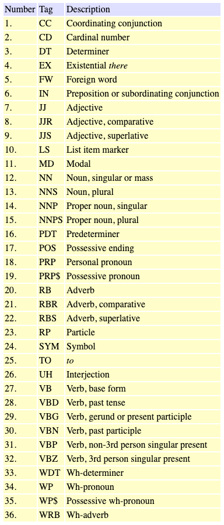
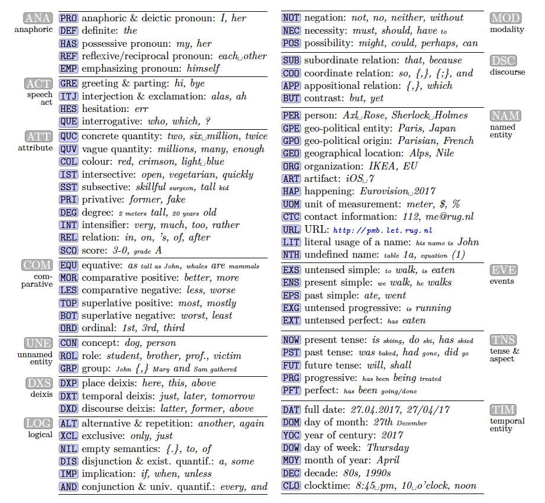

```{r setup}
if (!require(pacman)) install.packages("pacman")
library(pacman)
p_load(rio, tidyverse, tidytext, knitr, flextable,
       kableExtra,
       textreadr, gutenbergr, janitor)
opts_chunk$set(cache = TRUE)
```

## Digital text analysis: a look at the toolbox 

Having read [the NYT piece](https://www.nytimes.com/2020/10/12/style/self-care/social-media-.html) about social media text analysis, and perhaps from your own life in this digital world of ours!!, you have at least head about some of the methods that a "computational sociolinguist" or a "digital humanist" might apply to text. 

### Sentiment analysis

#### "Positive" versus "negative" words









#### Tag for more than 2 emotions




### Tag for parts of speech



### Tag for semantic classes 



## Start by loading our data

First we'll get an inventory of all the .DOCX files in our project directory.

```{r}
(textfiles <- list.files(pattern = ".docx"))
```

The second file has more formatting and may, for the time being, be more useful. We'll read it in. Here is the top of its content.

```{r}
f <- read_docx(textfiles[2])
f %>% head(10)
```

Here it is, converted to tabular format.

```{r}
f <- 
  f %>% 
  enframe() %>% 
  select(line = 2) %>% 
  mutate(file = textfiles[2])
f %>% 
  head(10) %>% 
  kbl() %>% 
  kable_styling(bootstrap_options = "striped", 
                full_width = F, 
                position = "left") 
```

## Narrowing down our interest

I have just received the latest notes from class: the interest seems to be in the difference between verse and prose *crossed with* an interest in character. I interpret this to mean that there are characters that appear both in verse and in prose sections, and we <mark>want to know how the language associated with each character differs from verse to prose.</mark>

In the text samples I have, character speech is not marked. We might be better off if we pull *Taming of the Shrew* from www.gutenberg.org.

Luckily there is an R module that interfaces with the Gutenberg archives. It is called `gutenbergr`. I will pull the whole text from there. 

```{r}
shakespeare <- 
  gutenberg_works(author == "Shakespeare, William") 

shakespeare                    %>% 
  mutate(entry = row_number()) %>% 
  select(entry, title)  %>% 
  kbl() %>% 
  kable_styling(bootstrap_options = "striped", 
                full_width = F, 
                position = "left") 
```

So our text is there and available, at index no. 10. 

```{r}
IDs <-  shakespeare[c(10),]$gutenberg_id

shakespeare %>% 
  filter(gutenberg_id %in% IDs) %>% 
  select(gutenberg_id, title)
```

Let's download the play and store it in an R object. I will call it `plays` (plural in case we add more texts or something.)

```{r}
plays <- gutenberg_download(IDs, meta_fields = "title")

plays %>% as_tibble()
```

I'll convert the data to one-word-per row now. It's the format we need for any of these analyses.

```{r}
sentiments <- plays %>%
  #group_by(title) %>%
  mutate(line = row_number()) %>% 
  unnest_tokens(word, text,
                to_lower = F) 

sentiments %>% 
  slice(150:190) %>% 
  kbl() %>% 
  kable_styling(bootstrap_options = "striped", 
                full_width = F, 
                position = "left") 
```


With my well-trained eye, I notice that "character names designating who's speaking" are all set in all-caps. Given this material property, we can insert a column into the data that states, for each word, who is speaking it. 

```{r warning=F, eval=FALSE}
play_with_speaker <- 
  sentiments %>% 
  mutate(speaker = NA)

two_word_name <- FALSE

speakername <- NA

for (i in (1:nrow(play_with_speaker))){
  
  # define the word that this loop looks at
  myword = play_with_speaker[i,] %>% 
    pull(word)
  
  # check whether word is identitcal to its all-caps conversion
  # if yes, then set it as speaker name
  if (myword == toupper(myword) & nchar(myword) > 1){
    speakername = myword
  }
  
  # write speaker name in speaker column
  play_with_speaker$speaker[i] = speakername
  cat("\014", i, "of", nrow(play_with_speaker))
}
cat("\014")
```

We'll export the dataset we've created so that next time the chunk won't need to run. We'll only need to import the data then.

```{r eval=FALSE}
play_with_speaker %>% 
  export("play_with_speaker.csv")
```

```{r}
play_with_speaker <- 
  import("play_with_speaker.csv")
```

Let's get a printout of the number of words spoken by each character.

```{r}
play_with_speaker %>% 
  count(speaker) %>% 
  arrange(desc(n)) %>% 
  filter(n > 25) %>% 
  kbl(position = "left",
      caption = "Words per character (showing only those with more than 25)") %>% 
  kable_paper(full_width = FALSE)
```

For later use, let's retain a list of the speakers who have significant enough amounts of speech. Let's set the cutoff even a bit higher, at 400 words. 

```{r}
sig_speakers <- 
  play_with_speaker %>% 
  count(speaker) %>% 
  arrange(desc(n)) %>% 
  filter(n >400) %>% 
  pull(speaker)
sig_speakers
```


```{r}
play_with_speaker %>% 
  slice(340:400) %>% 
  kbl(position = "left") %>% 
  kable_styling(full_width = F)
```

## Tag for sentiment 

For now, we'll just tag for pos. and neg. sentiment words

```{r}
sentiment <- 
  play_with_speaker %>% 
  mutate(word = tolower(word)) %>% 
  anti_join(stop_words) %>%          
  inner_join(get_sentiments("bing")) %>% 
  select(speaker, word, sentiment)

sentiment %>% 
  slice(300:330) %>% 
  kbl(position = "left") %>% 
  kable_paper(full_width = F)

```

With this data available, we can now plot the sentiment-per-speaker.

First we'll make a second dataset that is "wider": it has one row per speaker and it summarizes `n_neg, n_pos, n_total,` and `neg_ratio.` 

```{r}
sentiment_wide <- 
  sentiment %>% 
  filter(speaker %in% sig_speakers) %>% 
  count(speaker, sentiment) %>% 
  pivot_wider(
    names_from = sentiment,
    values_from = n
  ) %>% 
  mutate(n_total = negative + positive,
         neg_ratio = negative/positive) %>% 
  rename(n_neg = negative,
         n_pos = positive)
```

Some of this info will be useful to have in the main dataset `sentiment`. Therefore we'll `left_join()` the two.

```{r}
sentiment %>% 
  filter(speaker %in% sig_speakers) %>% 
  count(speaker, sentiment) %>% 
  left_join(select(sentiment_wide, speaker, n_total)) %>% 
  #---start plot code---#
  ggplot(aes(x = sentiment,
             y = n/n_total,
             fill = speaker)) +
  scale_y_continuous(labels = scales::percent_format()) +
  geom_bar(stat = "identity",
           position = "dodge") +
  scale_fill_viridis_d() +
  facet_wrap(~speaker) + 
  labs(y="sentiment words scored") +
  theme_classic(base_family = "Roboto Condensed") +
  theme(legend.position = "none")
```

Let's now plot just one bar for each speaker, the neg:pos ratio (or `neg_ratio`, as I will call it). So the highest value will be for the character with the most negative words.

```{r fig.cap="That Sly character must be miserable to be around.", fig.width=7, fig.height=7}
sentiment_wide %>% 
  #---start plot code---#
  ggplot(aes(x = reorder(speaker, neg_ratio),
             y = neg_ratio,
             fill = -neg_ratio)) +
   geom_hline(yintercept = 1,
             colour="black", 
             linetype="dashed") +
  geom_col(alpha=0.8) +
  scale_fill_viridis_b() +
  labs(
    title="Sentiment ratio by character",
    subtitle="Values > 1 indicate greater negative counts",
    caption="The Taming of the Shrew",
    y="negative vs. positive words",
       x=NULL) +
  coord_flip() +
  theme_classic(base_family = "Roboto Condensed") +
  theme(legend.position = "none")
```


